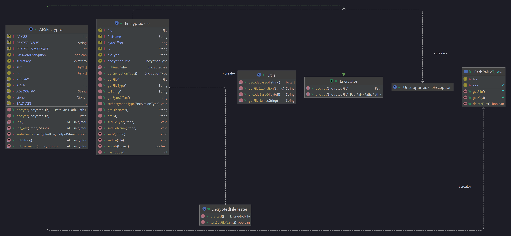

# Unit Deliverable 3 - Final Project

## UML

## WireFrame
look into Diagram folder for wireframe pdf

## How it works
- first select weather you want to encrypt or decrypt
- Then select a file
- Select the type of encryption you would like to use
- Select the method either Password or Key based encryption
- Wait for the program to prompt for file saving, and save the encryted or decrypted file
- Warning don't use large files, decryption process will fail due to algorithm implementation [Issue Note1](https://stackoverflow.com/questions/23864440/aes-gcm-implementation-with-authentication-tag-in-java) [Issue Note2](https://stackoverflow.com/questions/26920906/how-come-putting-the-gcm-authentication-tag-at-the-end-of-a-cipher-stream-requir)